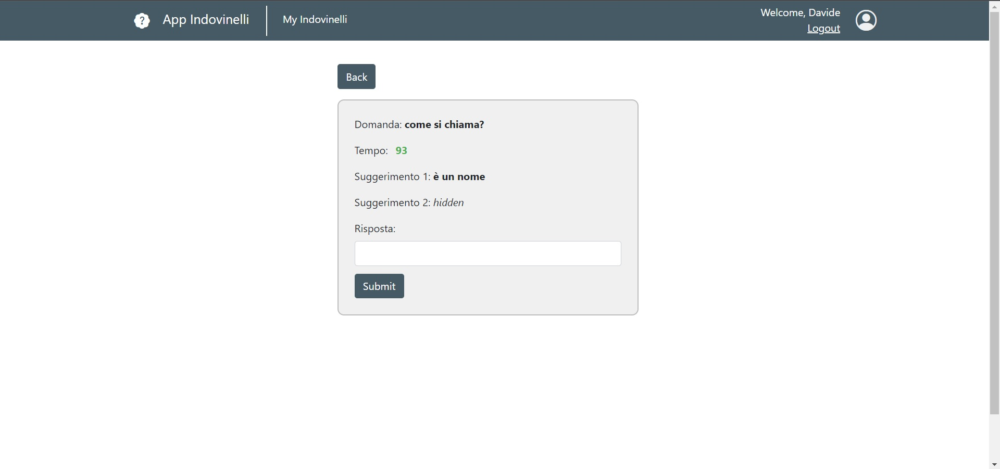

# Exam #301201: "Indovineli"
## Student: s301201 DAVIDE ANFOSSI 

## React Client Application Routes

- Route `/`: home page with list of indovinelli

- Route `/login`: login page
  
- Route `/myIndovinelli`: page with logged-in user's indovinelli
  
- Route `/visualizza/:idIndovinello`: page that shows useful information about a indovinello, :idIndovinello is id of a indovinello and is integer
  
- Route `/rispondi/:idIndovinello`: page that allows the logged-in user to submit a answer to a indovinello, :idIndovinello is id of a indovinello and is integer
  
- Route `/risultato/:stato`: page that shows if the given answer is corret, wrong or if the time ended, :stato can be "corretto", "errato" or "tempo"

## API Server

### GET 

#### **/api/indovinelli**

- **Return an array containing all indovinelli**.
- **Request body**: empty.
- **Response header**: `200 OK` (success).
- **Response body**: a JSON object containing all relevant information, or the description of the error(s).
  
Example of Response body:

```
[
    {
        "id": 1,
        "domanda": "come si chiama?",
        "soluzione": "davide",
        "sugg1": "è un nome",
        "sugg2": "inizia con d",
        "difficolta": "facile",
        "tempo": 300,
        "stato": "aperto",
        "user": 1,
        "start_time": null
    },
    ...
]
```

- **Error responses**: `500 Internal Server Error` (generic error).

#### **/api/users**

- **Return an array containing all users**.
- **Request body**: empty.
- **Response header**: `200 OK` (success).
- **Response body**: a JSON object containing all relevant information, or the description of the error(s).
  
Example of Response body:

```
[
    {
        "id": 1,
        "email": "piero.rossi@polito.it",
        "nome": "Piero",
        "hash": "49a9a1b95cedc80638f1688721eda332387efbafb3e491efef3c6d085047d3ae",
        "salt": "b2b348c98763365c",
        "punti": "0"
    },
    ...
]
```

- **Error responses**: `500 Internal Server Error` (generic error).

#### **/api/startTime/:idIndovinello**

- **Return startTime of a specific indovinello given its id**.
- **Request body**: empty.
- **Response header**: `200 OK` (success).
- **Response body**: a JSON object containing all relevant information, or the description of the error(s).
  
Example of Response body:

```
{
    "start_time": 1656930970104.0
}
```

- **Error responses**: `500 Internal Server Error` (generic error).

#### **/api/risposte/:id**

- **Return an array containing all risposte to a specific indovinello given its id**.
- **Request body**: empty.
- **Response header**: `200 OK` (success).
- **Response body**: a JSON object containing all relevant information, or the description of the error(s).
  
Example of Response body:

```
[
    {
        "id": 1,
        "indovinello": 1,
        "risposta": "matteo",
        "unser": 3
    },
    ...
]
```

- **Error responses**: `500 Internal Server Error` (generic error).

#### **/api/user**

- **Return info on the currently logged in user**.
- **Request body**: empty.
- **Response header**: `200 OK` (success).
- **Response body**: a JSON object containing info on the currently logged in user, or a description of the error(s)

Example of Response body:

```
{
    "id": 1,
    "email": "testuser@polito.it",
    "name": "testuser"
}
```

- **Error responses**: `401 Unauthorized` (the user is not currently logged in).


### POST

#### **/api/login**

- **Performs the login of the requesting user**.
- **Request body**: a JSON object containing username (email) and password.

Example of Request body:

```
{
    "username": "testuser@polito.it",
    "password": "password"
}
```

- **Response header**: `200 OK` (success).
- **Response body**: JSON object containing info on the just logged in user (same as GET /api/user), or a description of the error(s).

Example of Response body:

```
{
    "email": "testuser@polito.it",
    "name": "testuser"
}
```

- **Error responses**: `401 Unauthorized` (Incorrect email and/or password), `422 Unprocessable Entity` (username is not a valid email or password is not a valid string), `500 Internal server error` (generic error).

#### **/api/indovinello**

- **Creates a new indovinello**
- **Request body**: a JSON object containing all relevant information.
  
Example of Request body:

```
{
    "domanda": "come si chiama?",
    "soluzione": "davide",
    "sugg1": "è un nome",
    "sugg2": "inizia con d",
    "difficolta": "facile",
    "tempo": 300,
}
```

- **Response header**: `201 Created` (success). 
- **Response body**: eventual description of the errors in JSON format.

Example of Response body:

```
{
    "errors": [
        "error 1",
        ...
    ]
}
```

- **Error responses**: `422 Unprocessable Entity` (validation of request body failed), `500 Internal Server Error` (generic error).

#### **/api/risposta**

- **Creates a new risposta**
- **Request body**: a JSON object containing all relevant information.
  
Example of Request body:

```
{
    "indovinello": 1,
    "riposta": "matteo"
}
```

- **Response header**: `201 Created` (success). 
- **Response body**: eventual description of the errors in JSON format.

Example of Response body:

```
{
    "errors": [
        "error 1",
        ...
    ]
}
```

- **Error responses**: `422 Unprocessable Entity` (validation of request body failed), `500 Internal Server Error` (generic error).

### PUT

#### **/api/stato/:id**

- **Updates the stato of a specific indovinello given its id**
- **Request body**: a JSON object containing all relevant information.
  
Example of Request body:

```
{
    "stato": "chiuso"
}
```

- **Response header**: `200 OK` (success).
- **Response body**: eventual description of the errors in JSON format.

Example of Response body:

```
{
    "errors": [
        "error 1",
        ...
    ]
}
```

- **Error responses**: `422 Unprocessable Entity` (validation of request body failed or invalid id), `500 Internal Server Error` (generic error).

#### **/api/startTime/:idIndovinello**

- **Updates the startTime of a specific indovinello given its id**
- **Request body**: a JSON object containing all relevant information.
  
Example of Request body:

```
{
    "startTime": 1656930970104.0
}
```

- **Response header**: `200 OK` (success).
- **Response body**: eventual description of the errors in JSON format.

Example of Response body:

```
{
    "errors": [
        "error 1",
        ...
    ]
}
```

- **Error responses**: `422 Unprocessable Entity` (validation of request body failed or invalid id), `500 Internal Server Error` (generic error).

#### **/api/points**

- **Updates the punti of the logged-in user by summing the new value to the existing one**
- **Request body**: a JSON object containing all relevant information.
  
Example of Request body:

```
{
    "punti": 1
}
```

- **Response header**: `200 OK` (success).
- **Response body**: eventual description of the errors in JSON format.

Example of Response body:

```
{
    "errors": [
        "error 1",
        ...
    ]
}
```

- **Error responses**: `422 Unprocessable Entity` (validation of request body failed or invalid id), `500 Internal Server Error` (generic error).

### DELETE

#### **/api/session**

- **Delete the current session, a.k.a. logout**.
- **Request body**: empty.
- **Response header**: `200 OK` (success).
- **Response body**: eventual description of the error(s) in JSON format.

Example of Response body:

```
{
    "errors": [
        "Not authenticated"
    ]
}
```

- **Error responses**: `401 Unauthorized` (user wasn't logged in).

## Database Tables

- Table `indovinelli` - contains id, domanda, soluzione, sugg1, sugg2, difficolta, tempo, stato, user, start_time
- Table `risposte` - contains id, indovinello, risposta, user
- Table `users` - contains id, email, nome, hash, salt, punti

## Main React Components

- `Page` (in `Components.js`): homepage of the web application, contains the list of indovinelli
- `MyIndovinelli` (in `Components.js`): page with indovinelli of the logged-in user and a form to create a new one
- `Visualizza` (in `Components.js`): component that shows infos about a indovinello
- `Rispondi` (in `Components.js`): component that allows the user to submit his answer to a indovinello
- `NotFoundPage` (in `Components.js`): component for wrong url
- `NetErrors` (in `Components.js`): component to disply errors
- `Timer` (in `Components.js`): timer component for a indovinello
- `IndovinelliTable` (in `Components.js`): indovinelli table component
- `TopTable` (in `Components.js`): top users by punti table component

(only _main_ components, minor ones may be skipped)

## Screenshot



## Users Credentials

| email                     | password | name   |
| ------------------------- | -------- | ------ |
| piero.rossi@polito.it     | 1        | Piero  |
| davide.anfossi@polito.it  | 1        | Davide |
| john.doe@polito.it        | password | John   |
| mario.rossi@polito.it     | 123456   | Mario  |
| franco.rainieri@polito.it | 2        | Franco |

